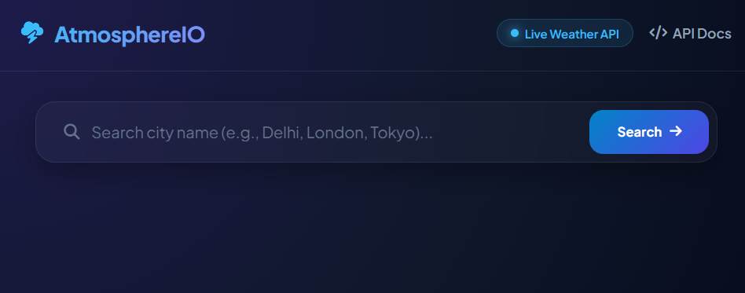
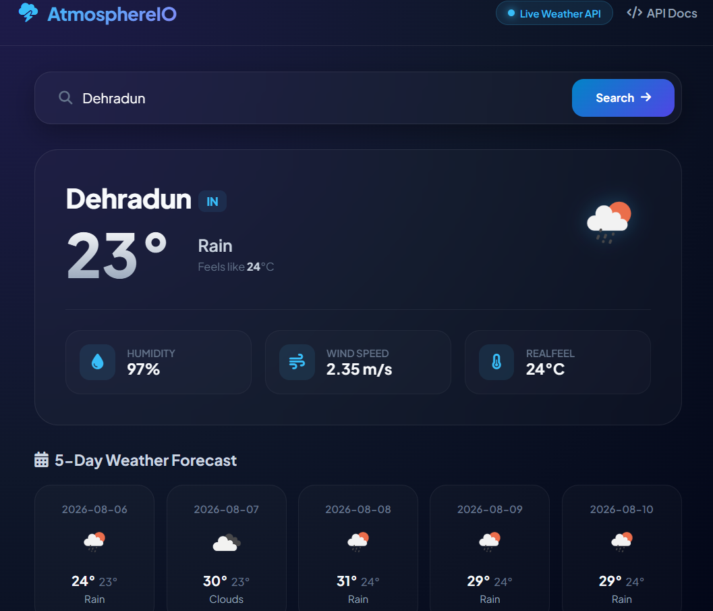
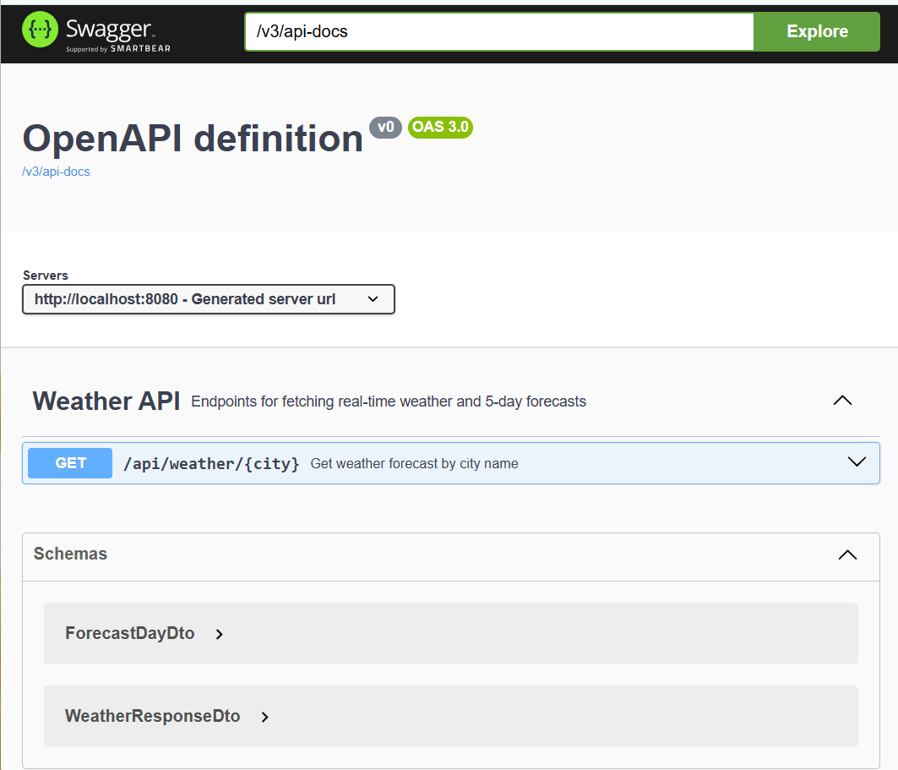

<div align="center">

# 🌤️ AtmosphereIO - Real-Time Weather Forecast Engine

An enterprise-grade, high-performance Weather Forecasting & Analytics Platform built using Spring Boot 3, Java 21, OpenWeatherMap REST API, Caffeine Cache, and Glassmorphism UI.

[](https://www.oracle.com/java/)
[](https://spring.io/projects/spring-boot)
[](https://openweathermap.org/api)
[](#)
[](LICENSE)

</div>

---

## 📌 Table of Contents
- [Overview](#-overview)
- [Key Features](#-key-features)
- [Tech Stack](#-tech-stack)
- [Architecture & System Flow](#-architecture--system-flow)
- [Project Structure](#-project-structure)
- [Getting Started](#-getting-started)
- [Prerequisites](#prerequisites)
- [Configuration](#configuration)
- [Build and Run](#build-and-run)
- [API Documentation](#-api-documentation)
- [Screenshots & UI Showcase](#-screenshots--ui-showcase)
- [Contributing](#-contributing)
- [Future Enhancements](#-future-enhancements)
- [License](#-license)

---

## 🌐 Overview

**AtmosphereIO** is designed to fetch real-time weather metrics and aggregate 5-day forecasts across global cities using external OpenWeatherMap REST APIs.

By incorporating **Caffeine In-Memory Caching (`@Cacheable`)**, the application eliminates redundant API calls, avoids rate limits, and delivers sub-millisecond execution times for repeated queries.

---

## ✨ Key Features

* ⚡ **Sub-Millisecond Response Time:** Powered by Caffeine In-Memory Cache (`@Cacheable`) for near-instant response handling.
* 🌡️ **Real-Time Weather Tracking:** Delivers live updates for temperature, real-feel metrics, humidity, and wind speed.
* 📅 **5-Day Daily Aggregated Forecast:** Aggregates multi-hour interval forecasts into consolidated daily min/max temperature forecasts.
* 🛡️ **Global Exception Handling:** Custom exceptions and REST advice delivering structured JSON error responses for invalid cities.
* 🎨 **Modern Dark Glassmorphism UI:** Fully responsive dashboard built with HTML5, CSS3, FontAwesome, and Plus Jakarta Sans typography.
* 📄 **OpenAPI / Swagger Integration:** Interactive API documentation available out-of-the-box via Springdoc OpenAPI 3.0.

---

## 🛠️ Tech Stack

### **Backend Frameworks & Tools**
* **Language:** Java 21
* **Framework:** Spring Boot 3.2.3 (Spring Web MVC)
* **External Integration:** RestTemplate & OpenWeatherMap API
* **Caching:** Caffeine In-Memory Cache
* **API Documentation:** Springdoc OpenAPI / Swagger UI
* **Build Tool:** Apache Maven

### **Frontend & UI**
* **Core:** HTML5, Modern JavaScript (ES6)
* **Styling:** Custom CSS3 (Glassmorphism & Flex/Grid)
* **Icons & Fonts:** FontAwesome & Google Fonts (Plus Jakarta Sans)

---

## 📁 Project Structure

```text
weather-app/
├── .github/
│   └── workflows/              # GitHub Actions CI/CD pipelines (optional)
├── Screenshot/                  # Project screenshots for documentation
│   ├── Screenshot_Dashboard.png
│   └── Screenshot_Swagger.png
├── src/
│   ├── main/
│   │   ├── java/com/example/weatherapp/
│   │   │   ├── config/          # Cache & RestTemplate Configurations
│   │   │   ├── controller/      # REST API Controllers & Swagger Annotations
│   │   │   ├── dto/             # Data Transfer Objects (WeatherResponseDto, ForecastDayDto)
│   │   │   ├── exception/       # Global Exception Handler & REST Error Responses
│   │   │   ├── service/         # Weather Aggregation Service & Caffeine Caching
│   │   │   └── WeatherAppApplication.java # Main Application Entry Point
│   │   └── resources/
│   │       ├── static/          # Frontend Dashboard (HTML, JS, CSS)
│   │       │   └── index.html
│   │       └── application.yaml # Server, API & Spring Configuration
│   └── test/                    # Unit & Integration Tests
├── .gitignore                   # Git Ignore File
├── LICENSE                      # MIT Open Source License
├── pom.xml                      # Maven Dependencies & Build Setup
└── README.md                    # Project Documentation
```
---
## 🏗️ Architecture & System Flow
```text
          +----------------------------------+
          |      Client (Browser / Mobile)    |
          +----------------+-----------------+
                           |
                           | HTTP Requests (UI / REST API)
                           v
          +----------------------------------+
          |     Spring Boot Application      |
          +----------------+-----------------+
                           |
            +--------------+---------------+
            |                              |
            v                              v
+-----------------------+      +-----------------------+
| Global Exception      |      |   Weather Controller  |
| Handler Advice        |      |  (Swagger OpenAPI)    |
+-----------------------+      +-----------+-----------+
                                           |
                                           v
                               +-----------------------+
                               |    WeatherService     |
                               |     (@Cacheable)      |
                               +-----------+-----------+
                                           |
            +------------------------------+------------------------------+
            |                                                             |
            v                                                             v
+-----------------------+                                     +-----------------------+
| Caffeine In-Mem Cache |                                     |  OpenWeatherMap API   |
|  (Fast Read / Cache)  |                                     |  (External REST API)  |
+-----------------------+                                     +-----------------------+

```
---
## 🚀 Getting Started

### Prerequisites

Ensure you have the following installed on your machine:
* **Java Development Kit (JDK 17+)**
* **Apache Maven 3.8+**
* **OpenWeatherMap Free API Key**
* **Git**

### Clone Repository

```bash
git clone [https://github.com/Govind-2401/weather-app.git](https://github.com/Govind-2401/weather-app.git)
cd weather-app
```
### Configuration

Update your OpenWeatherMap API Key in `src/main/resources/application.yaml`:

```yaml
weather:
  api:
    key: YOUR_ACTUAL_OPENWEATHERMAP_API_KEY
    base-url: [https://api.openweathermap.org/data/2.5](https://api.openweathermap.org/data/2.5)
```
### Build and Run the Project
```Bash
mvn clean package -DskipTests
mvn spring-boot:run
```
### Access the Application
Web Dashboard: http://localhost:8080/

Swagger API Docs: http://localhost:8080/swagger-ui.html

---
## 📌 Key API Endpoints

### Endpoints Overview

| Method | Endpoint | Description |
| :--- | :--- | :--- |
| `GET` | `/api/weather/{city}` | Fetches real-time weather metrics, humidity, wind, and 5-day aggregated forecast. |

---

### Request Example (`GET /api/weather/Delhi`)

```bash
curl -X GET "http://localhost:8080/api/weather/Delhi"
```

### Response Example (200 OK)

```JSON
{
  "city": "Delhi",
  "country": "IN",
  "currentTemperature": 32.5,
  "feelsLike": 34.1,
  "humidity": 62,
  "windSpeed": 4.12,
  "condition": "Haze",
  "icon": "50d",
  "forecast": [
    {
      "date": "2026-08-06",
      "minTemp": 28.0,
      "maxTemp": 35.2,
      "humidity": 60,
      "condition": "Clear",
      "icon": "01d"
    }
  ]
}
```
---
## Screenshots & UI Showcase
### 1. Main Dashboard-
   The modern dark Glassmorphism dashboard displaying real-time metrics, real-feel values, humidity, and wind speed.

   
---

### 2. 5-Day Forecast Grid-
   Displays aggregated daily forecast cards with minimum/maximum temperature trends and dynamic weather icons.

   
---

### 3. Swagger API Documentation (OpenAPI 3.0)-
   Interactive Swagger UI listing endpoints (/api/weather/{city}) and response schemas.

   
---

## 🤝 Contributing
Contributions are what make the open-source community such an amazing place to learn, inspire, and create. Any contributions you make are greatly appreciated!

If you have a suggestion that would make this better, please fork the repo and create a pull request. You can also simply open an issue with the tag "enhancement".

1. Fork the Project

2. Create your Feature Branch

```Bash
git checkout -b feature/AmazingFeature
```
Commit your Changes
```Bash
git commit -m "feat: add some AmazingFeature"
```
Push to the Branch
```Bash
git push origin feature/AmazingFeature
```
Open a Pull Request

---

## 🔮 Future Enhancements
Planned features and improvements for future releases:

📍 Geolocation Auto-Detection: Automatically detect user IP/GPS to serve instant local weather updates.

🗺️ Interactive Weather Maps: Integration of Mapbox/Leaflet JS for radar precipitation and temperature heatmaps.

🚨 Severe Weather Alerts: Notification banners for storms, floods, or high UV index warnings.

📦 Distributed Caching (Redis): Upgrading from Caffeine in-memory cache to Redis for cluster deployments.

🐳 Dockerization & Cloud Deployment: Containerizing the application using Docker for deployment on cloud platforms (AWS / Render).

---

## License
Distributed under the MIT License. See the LICENSE file for more information.

Made with ❤️ by Govind

---
